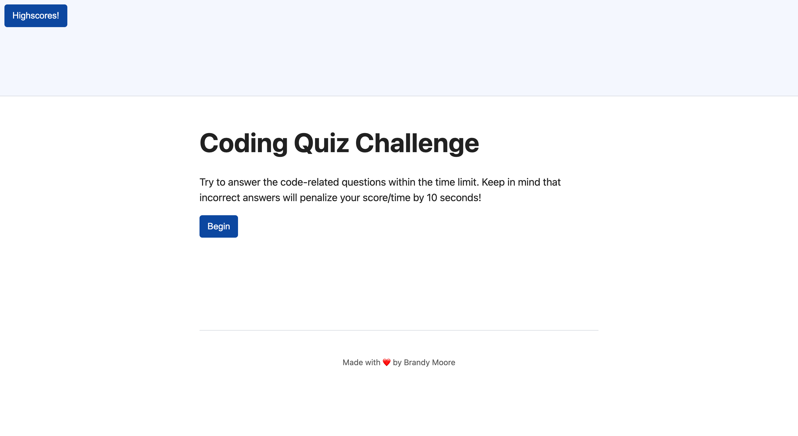

# code-quiz-project
04-Web-APIs

## Table of Contents
1. [Description](#Description)
2. [Visuals](#visuals)

## Description
This code quiz project is a timed multiple-choice questioned quiz. This quiz features 4 questions, a timer, and a leadership board. When you press the begin button questions will begin to populate and the timer will begin. If questions are answered incorrectly, time is deducted. This project was completed using HTML, CSS, and JavaScript.  
[Link to live site]

## Visuals

